# Naive-bayes
Naive Bayes classificator implementation.

# Bayes' Theorem

Bayes' Theorem is a fundamental rule in probability theory that allows us to update the probability of an event based on new evidence. It is expressed as:

$\[ P(A|B) = \frac{P(B|A) \cdot P(A)}{P(B)} \]$

Where:
- P(A|B) is the conditional probability of event A occurring given that event B has occurred.
- P(B|A) is the conditional probability of event B occurring given that event A has occurred.
- P(A) is the probability of event A occurring independently.
- P(B) is the probability of event B occurring independently.

Bayes' Theorem is widely used in various fields, including machine learning, statistics, and data science, to make predictions and update beliefs based on observed evidence.

# Theory
Naive Bayes classification is a powerful application of Bayes' Theorem used for classification tasks in machine learning. The algorithm is based on the assumption that the features are independent (unrelated to each other), which gives the technique its name "naive". 

The Naive Bayes Classifier employs Bayes’ theorem to estimate membership probabilities for each class, indicating the likelihood that a given record or data point belongs to a specific class. The class with the highest likelihood is then identified as the most probable class.

# Implementation - Gaussian Naive Bayes Classifier

The Gaussian Naive Bayes Classifier assumes a normal distribution of continuous values associated with each class. The implementation involves computing the mean and standard deviation for each class. Then, it estimates the likelihood for a new given sample based on the Gaussian Probability Distribution Function (Gaussian PDF) calculated as:

$\[ f(x) = \frac{1}{\sqrt{2 \cdot \pi} \cdot \sigma} \cdot \exp\left(-\frac{(x - \text{mean})^2}{2 \cdot \sigma^2}\right) \]$

Where:
- $\sigma$ is the standard deviation for variable $x$
- `mean` is the mean for variable $x$.
- $\pi$ is the value of pi (approximately 3.14159).

Next the total number of training records is calculated from the counts stored in the summary statistics. This is used in the calculation of the probability of a given class or P(class) as the ratio of rows with a given class of all rows in the training data.

The likelihood that a new sample belongs to a given class is calculated as:

$\[ P(\text{class|data}) = P(X|\text{class}) \cdot P(\text{class}) \]$

For instance, if we have 2 input variables (features X1 and X2), the likelihood of a new sample belonging to the first class (class 0) can be calculated as follows:

$\[ P(\text{class=0|}X1,X2) = P(X1|\text{class=0}) \cdot P(X2|\text{class=0}) \cdot P(\text{class=0}) \]$

This is repeated for each class and a dictionary of likelihoods is returned with one entry for each class.

# Algorithm flow

# Used data structures

Our implementation uses [Pandas](https://github.com/pandas-dev/pandas)'s Dataframes to store training data. Dataframes are among standard data structures used by data scientists; their most useful feature in this project were in-built functions that proccessed data column-wise(as seen in `summarize_dataset()`). Pandas' ability to read CSV files and convert them into Dataframe was also useful.
For data grouped by label values we used Python's dictionaries to store all similar data in one data structure, but at the same time be able to easily retrieve data relevant to only certain label.
We also make use of plain Python lists to pass data for classification and tuple for classifier output.

# Modules

For better workspace organisation, we grouped functions into their submodules.
## `data`

This submodule handles proccessing data to and inside the `train` Dataframe. It takes care of grouping the data and estimating the mean and standard deviation of feature distributions.

## `analysis`

Responsible for probability calculation. It handles calculation *a priori* probabilities for labels and providing a probability distributions for feature value vectors.

## `classifier`

The Gaussian naive Bayes classifier. It handles sample classification based on provided training data.